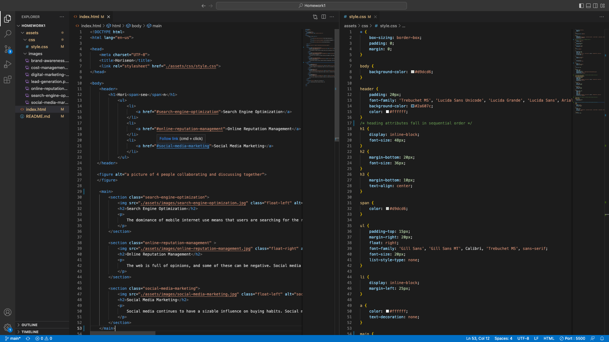

# Challenge 1 - Horiseon (by Chen, Donglan )

## Description

To help a marketing agency
I made a codebase that follows accessibility standards
SO THAT their site is optimized for search engines

GIVEN a webpage meets accessibility standards
It has semantic HTML elements
The structure of the HTML elements follow a logical structure independent of styling and positioning
The icon and image elements have accessible alt attributes
The heading attributes fall in sequential order
The title element has a concise, descriptive title

## Screenshot

## link to deployed application
https://chenson92.github.io/Homework1/

## Credits

N/A

## License

MIT license 
Please refer to the LICENSE in the repo.
